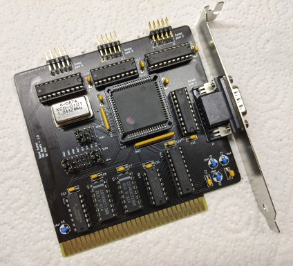

# ISA Quad UART Adapter

## Introduction

This 8-bit ISA board will provide 4 serial RS232 ports using a single 16C554 controller.

IRQs will be shared between port 1/3 and port 2/4.



### Disclaimer

I take NO responsibility for what happens if you decide to build and use this card. Your computer might crash, catch fire or be destroyed in other nasty ways.
You're encourauged to take what you deem fit from this, and use it in your projects!

## Configuration

This board is configured via two blocks of jumpers:

```text
    .... SER4 
    ....
    .... SER3
IIII2323
RRRREEFF
QQQQ8888
3457
........ SER2
........
........ SER1
```

The upper block will select the address for port 3 (first row) and port 4 (third row). To select an address, you need to bridge the middle row at the specified address with the top or bottom row (depending on which port you wish to assign that address).

The bottom block selects the address for ports 1 and 2, and the IRQs for ports 1/3 and 2/4. The principle is the same.

Default configuration is as follow:
```text
    |... SER4 
    ||..
    .|.. SER3
IIII2323
RRRREEFF
QQQQ8888
3457
|.....|. SER2
||....||
.|.....| SER1
```

Which will assign 0x3F8 to port 1, 0x2F8 to port 2, 0x3E8 to port 3 and 0x2E8 to port 4.
Port 1/3 will get IRQ4 and port 2/4 will get IRQ3.

## Bill of Materials

- 4x 10uF / 25v capacitors
- 13x 100nF / 25v ceramic capacitors
- 1x 9-pin 10k bussed resistor network (RN3)
- 1x 5-pin 10k bussed resistor network (RN2)
- 1x 1.8432Mhz DIP14 or DIP8 oscillator
- 1x DB9 right angle, male, PCB mount connector
- 1x 1x20pin 2.54mm straight header strip (you will cut this as needed)
- 1x 2x20pin 2.54mm straight header strip (you will cut this as needed)
- 1x 2x20pin 2.54mm angled header strip (you will cut this as needed)
- 4x 75C185 RS232 drivers (U5, U6, U25, U26)
- 2x 74HCT138 (U1, U2)
- 1x 74HCT32 (U24)
- 1x 74HCT21 (U30)
- 1x 74HCT245 (U29) (with some controllers, like TL16C554, I noticed improved stability by using a 74LS245)
- 1x SC16C654, ST16C554 (U23) (all the 16C554 / 16C654 should be compatible, but to get TL16C554 working properly I had to replace U29) 
- Jumpers for board configuration
- Keystone 9200-1 bracket
 
